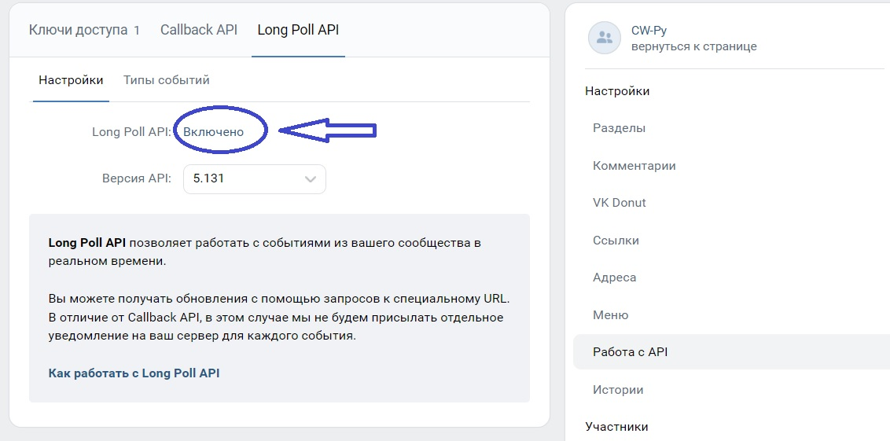
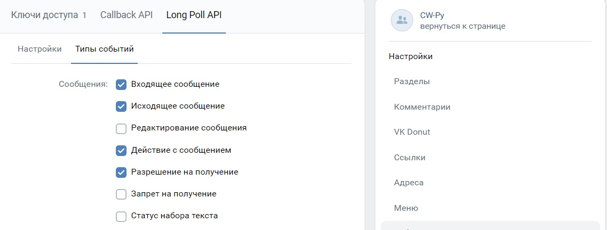
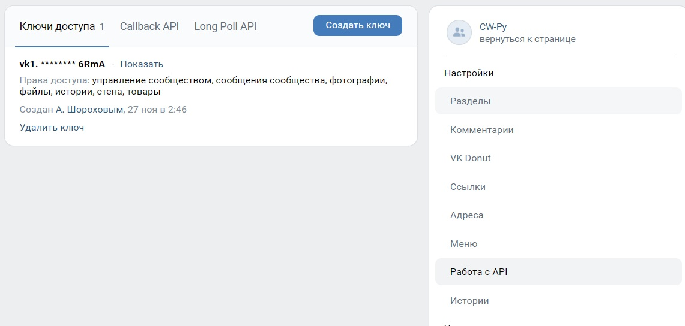
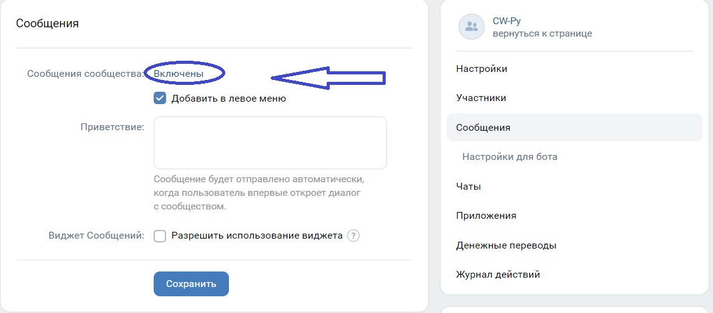
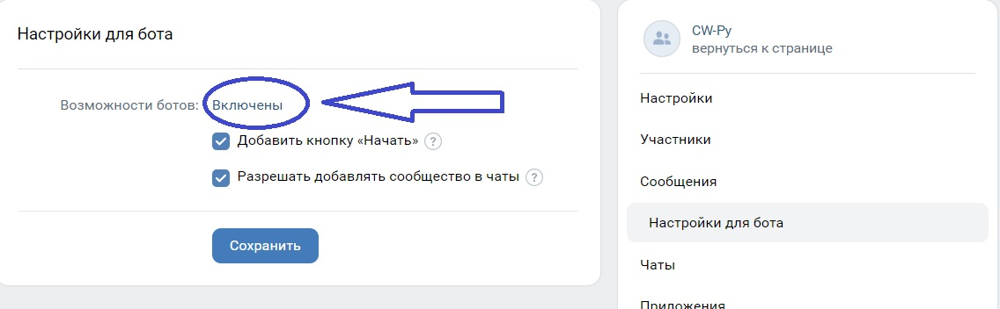
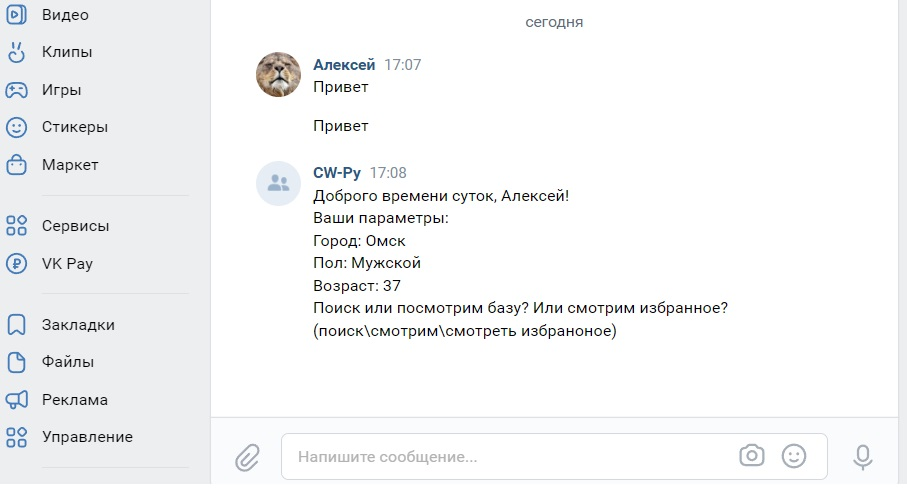
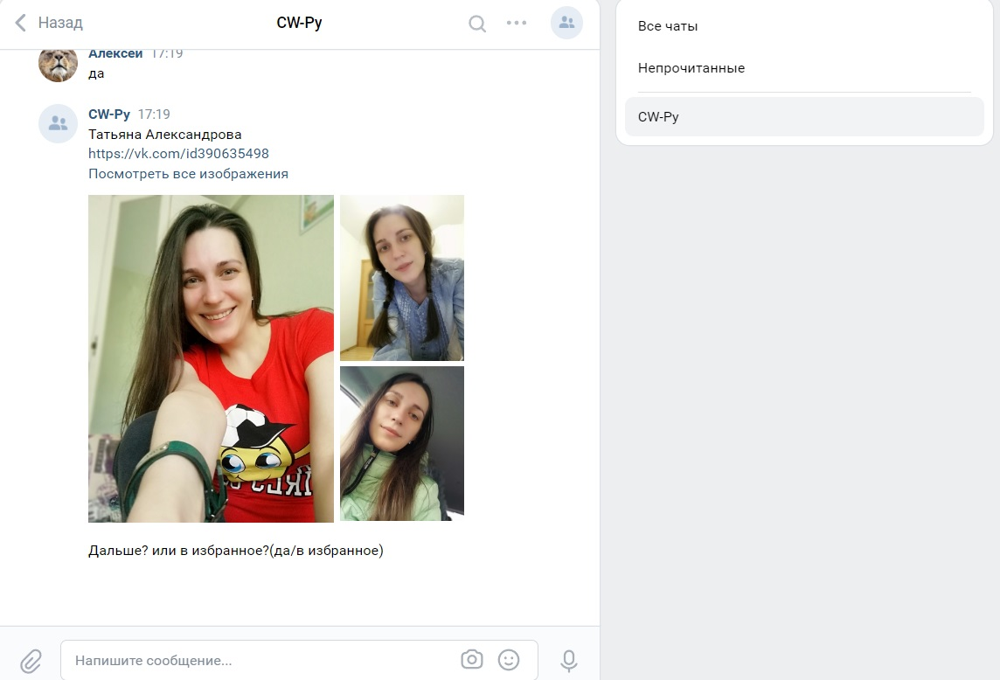

# Командный проект VKinder
## Документрация по использованию программы:
1. Создать группу во Вкотакте, от имени которой будет общаться разрабатынный бот
2. Создать токен для бота:
    * Зайти в созданную группу -> Управление -> Работа с API. Вкладка "LongPoll API", ключить LongPoll API
    
    * Перейти во вкладку "Типы событий" и дать боту соответствующие права
    
    * Вернуться во кладку "Ключи доступа". Создать ключ
     
    * Перейти в Управление -> Сообщения Убедиться, что Сообщения сообщества включены:
    
    * Перейти в Управление -> Сообщения -> Настройки для бота, включить "Возможности ботов"
    
    * В корне проекта создать текстовый файл bot_token.txt, перейти  Управление -> Работа с API, скопировать созданный ключ и сохранить в этот файл
3. Далее необходимо создать токен для пользователя, который будет общаться с ботом:
    * Получить токен для ВК можно выполнив [инструкцию](https://docs.google.com/document/d/1_xt16CMeaEir-tWLbUFyleZl6woEdJt-7eyva1coT3w/edit?usp=sharing)
    * В корне проекта создать текстовый файл user_token.txt и сохранить в него полученый токен
4. Установим зависимости из файла requirements.txt командой 
```python
pip install -r requirements.txt
```
5. Для работы программы нужна база данных. Создадим базу postgre SQL:
```console
createdb -U postgres course_w
```
где postgres имя пользователя, course_w название базы данных
6. В файле main.py заполним необходимы данные для работы базы данных:
```python
conn = psycopg2.connect(database="course_w", user="postgres", password="password")
```
7. Теперь всё готово для начала работы с ботом. Запустим программу
8. В созданной группе напишем сообщение боту "Привет". Бот получит данные о пользователе и выведет их в ответном приветственном сообщении и спросит вас о дальнейших действиях

9. Если вы уже пользовались поиском, то база данных не пустая и следует продолжить просмотр выполнив команду "смотрим", либо если были добавлены люди в избранное, можно вывести его содержимое выполнив команду "смотреть избранное". Если база данных пустая, выполним команду "поиск". Бот выполнит поиск по вашим параметрам и сохранит в базу данных всех не приватных пользователей.
10. Когда бот завершит поиск, он выведет сообщение "Данные записаны в базу. Смотрим?(да)". Введем команду "Да" для начала просмотра каталога пользователей.

11. Если человек понравился, можно добавить его в избранное, выполнив команду "В избранное" (*Если человек добавлен в избранное, то при повторном просмотре каталога он не будет выведен*)
12. Если человек неприятен и его больше не хочется видеть, то команда "в черный список" или "нет", поможет нам его скрыть, при повторном просмотре базы данных он не будет отображаться.
13. Для перехода к следующему человеку введём команду "да"
14. После того как будет просмотрен весь каталог, бот выведет сообщение "Мы посмотрели всё! Заново? (да/смотреть избранное)"
15. Стоит отметить, если бот нашел достаточно много пользователей подходящих нашим параметрам, он будет выполнять photos.get запрос для каждого, поэтому время ожидания может быть достаточно существенным и API может дисконнектить бота. Все полученные данные будут записаны в базу данных. Если это произошло, бот перезапустится и выведет в чат сообщение "Бот на связи", достаточно с ним поздороваться или ввести одну из команд описаных выше. 
16. В консоли визуально можно отслеживать ход выполнения программы.
